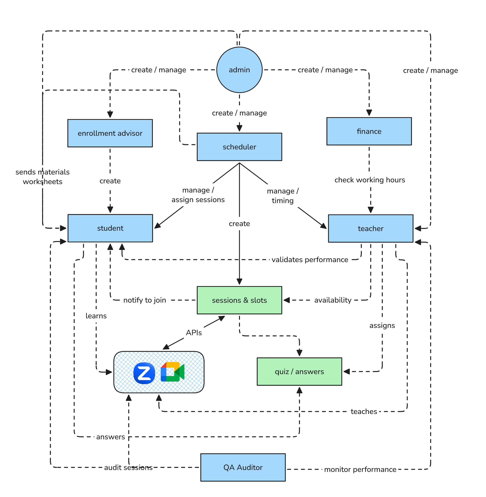

# Product Requirements Document (PRD)

## Executive Summary

**Product Name:** Finquo

**Problem Statement:** There's no reliable single system that teaches kids 

- [Codebase](https://github.com/finquo/app)

**Proposed Solution:** A platform that schedules sessions and classes for students with already hired specialist and mentor through online.

**Launch Target:** [21-10-2026]

## Goals & Success Criteria

### Business Goals
1. Make money
2. Teach students

### User Goals
1. Parent will be happy that their children is learning latest and real world knowledge
2. Students learns real world knowledge
3. Platform make it easy for them to get connected to Teachers

### Non-Goals (Out of Scope)
- Fully automate scheduling
- Multiple students in a meeting

## User Personas & Use Cases

### Primary Persona: [Student]
- **Role:** Student
- **Goals:** Learn
- **Pain Points:** Hard to find courses or mentors
- **Technical Proficiency:** Beginner
- **Context:** Uses this platform after school, weekends, vacation days

### Secondary Persona: [Teacher]
- **Role:** Teacher (freelance employee)
- **Goals:** Teach
- **Pain Points:** Hard to students
- **Technical Proficiency:** Medium
- **Context:** Uses this platform every weekdays multiple times a day

### Moderator Persona: [Scheduler]
- **Role:** Scheduler (employee at Finquo)
- **Goals:** Schedule sessions, manage students and teachers
- **Pain Points:** A platform to do and view everything in one place
- **Technical Proficiency:** High
- **Context:** Uses this platform every days multiple times a day

### Other Personas: [Admin]
- **Role:** Owner of Finquo
- **Goals:** Manage employees and hire more teachers
- **Pain Points:** A platform to do and view everything in one place
- **Technical Proficiency:** Medium
- **Context:** Uses this platform once in a week
- 
### Other Personas: [Enrolement Adviced]
- **Role:** Salesmen at Finquo
- **Goals:** Collect leads and create accounts for students
- **Pain Points:** A platform to add students faster
- **Technical Proficiency:** Beginner
- **Context:** Uses this platform every weekdays multiple times a day
- 
### Other Personas: [Finance]
- **Role:** HR/Finance at Finquo
- **Goals:** Monitor teacher and pay their salaries
- **Pain Points:** A platform to monitor teacher's performances
- **Technical Proficiency:** Medium
- **Context:** Uses this platform every weekdays multiple times a day

### Other Personas: [QA Auditor]
- **Role:** HR/QA at Finquo
- **Goals:** Monitor the systema and performance or teacher and resolve complaints
- **Pain Points:** A platform to monitor teacher's performances and track issues
- **Technical Proficiency:** Medium
- **Context:** Uses this platform every weekdays multiple times a day

### Key Use Cases

#### Use Case 1: [Create account for students]
**Actor:** Enrolement Advicer
**Preconditions:** Student's parent should purchase the program
**Flow:**
1. Enrolement Advicer: Create student profile and account credentials
2. System: Checks student is unique and sends credentials via whatsapp or email
3. Student: Goes to the platform and login
4. System: Make sure student credentials are valid

**Expected Outcome:** Students will be able to see their profile and update credentials
**Edge Cases:** Students don't know how to login

#### Use Case 2: [Create Personalized Sessions]
**Actor:** Scheduler
**Preconditions:** Valid Student Account
**Flow:**
1. Scheduler: Create sessions data, lessons, and quiz
2. System: Creates unique sessions
3. Scheduler: Search and assign to students in a particular order
4. System: Checks students profile has enough program limit to accommodate these sessions

**Expected Outcome:** Students will be able to see, what session are available to them
**Edge Cases:** Assigns more sessions to a student

#### Use Case 3: [Admin hired a teacher]
**Actor:** Admin
**Preconditions:** Valid admin privileges
**Flow:**
1. Admin: Create teacher's profile and account credentials
2. System: Checks teacher is unique and sends credentials via whatsapp or email
3. Teacher: Goes to the platform and login
4. System: Make sure teacher's credentials are valid
3. Teacher: Update their availability
4. System: Mark teach as active

**Expected Outcome:** Teacher will be able to see their profiles and update
**Edge Cases:** Teacher don't know how to login

#### Use Case 4: [Assigns Sessions]
**Actor:** Scheduler
**Preconditions:** Valid Student & Teacher Account
**Flow:**
1. Scheduler: Pick a student and assigns teacher as default mentor
2. System: Make sure teacher is compatible with students preferred languages
3. Scheduler: Pick a student and assigns each sessions with default mentor or available mentor
4. System: Checks teacher availability or raise conflict info against already created sessions

**Expected Outcome:** Students will be able to see, which teachers are assigned for each session and their default mentor
**Edge Cases:** Limited teachers or conflict of scheduled time. Mentor is no longer available for future sessions

## Product Requirements

### Functional Requirements

#### Must Have (P0) - MVP
1. **Role Managament**: Create, Update, Manage all type of users
2. **Schedule Meeting**: Set a meeting for students and teachers
3. **Sessions**: Ability to customize sessions and assigns to every student
4. **Dynamic Zoom/Google Meet**: Scalable way to generate meeting links
5. **Notification through Whatsapp**: Trigger notifications for each sessions before 10 mins
6. **AI Video to Summary**: Preview session recording and extract summary for QA Auditor

#### Should Have (P1) - Post-Launch
1. **Observability**: Status, Health and Live Dashboard for admin
2. **Scalable Infra**: CI/CD pipelines for developers
3. **Accessibility**: for kids and parents

#### Nice to Have (P2) - Future Consideration
1. **Nice UI**: for mobile and desktop view
2. **Localization**: for multiple countries and languages

### Non-Functional Requirements

#### Performance
- Load time requirements: e.g., "Page load < 2 seconds"
- Response time: e.g., "API response < 500ms"
- Concurrent users: Support 1K

#### Security & Privacy
- Authentication requirements
- Data encryption standards
- Compliance requirements: GDPR, CCPA, etc.
- User data handling policies

#### Scalability
- Expected growth: Scale to 10K users in 1 year
- Infrastructure considerations

#### Accessibility
- WCAG compliance level: A, AA, or AAA
- Keyboard navigation requirements
- Screen reader support

#### Browser/Platform Support
- Supported browsers and versions
- Mobile platform requirements: iOS, Android
- Responsive design breakpoints

<!--
## User Experience & Design

### User Flow Diagram
[Link to or embed user flow diagram - Figma, Miro, etc.]

### Wireframes/Mockups
[Link to design files or embed key screens]

### Key Interactions
1. **[Interaction Name]**
   - **Trigger:** [What initiates this interaction]
   - **Behavior:** [What happens]
   - **Feedback:** [How system responds to user]

### Design Principles for This Product
- [Principle 1: e.g., "Minimize clicks to core action"]
- [Principle 2: e.g., "Progressive disclosure of complexity"]
- [Principle 3: e.g., "Clear error states and recovery paths"]
-->

## Technical Specifications

### System Architecture
[High-level architecture overview - link to detailed technical design doc if available]

### Data Model

### API Requirements

#### Endpoints
| Endpoint | Purpose |
|----------|---------|
| `/api/auth` | Auth |
| `/api/*` | Logical APIs |

### Third-Party Integrations
- **Zoom SDK:** Need credentials after subscriptions
- **OpenRouter AI SDK:** Need credentials after subscriptions
- **Meta Whatsapp:** Need credentials
- **AWS Admin Account:** Need a custom user with full access to AWS platform

### Technical Constraints
- AWS too complex for a simple project like this
- Zoom and Google Meeting API limitations and live recording

### Analytics & Tracking

#### Events to Track
| Event Name | Trigger | Properties | Purpose |
|------------|---------|------------|---------|
| `API Error` | When it fires | Data captured | For DX |
| `Zoom/Google Meet Error` | When it fires | Captured & Alert | For UX |

<!--
## Go-to-Market Strategy

### Launch Plan
- **Beta/Alpha Testing:** [Timeline, participant criteria, feedback loop]
- **Phased Rollout:** [If applicable - % of users per phase]
- **Launch Date:** [Target date]
- **Launch Channels:** [How we'll announce: email, blog, in-app, PR, etc.]

### Marketing & Positioning
- **Value Proposition:** [One sentence describing the value]
- **Key Messages:** 
  - [Message for user segment 1]
  - [Message for user segment 2]
- **Marketing Channels:** [Paid ads, content, partnerships, etc.]

### Sales Enablement (if B2B)
- **Sales Materials:** [Decks, one-pagers, demo scripts]
- **Pricing/Packaging:** [How this fits into pricing tiers]
- **Training Required:** [What sales team needs to know]

### Support & Documentation
- **User Documentation:** [Help articles, tutorials, videos]
- **Support Team Training:** [Timeline, materials needed]
- **FAQ:** [Common questions and answers]

## Dependencies & Risks

### Dependencies
| Dependency | Owner | Status | Impact if Delayed | Mitigation |
|------------|-------|--------|-------------------|------------|
| [Dependency 1] | [Team/Person] | [On Track/At Risk/Blocked] | [Impact] | [Plan B] |
| [Dependency 2] | [Team/Person] | [Status] | [Impact] | [Plan B] |

### Risks & Mitigation

#### High Risk
1. **[Risk Description]**
   - **Probability:** [High/Medium/Low]
   - **Impact:** [High/Medium/Low]
   - **Mitigation:** [How we'll address this]
   - **Owner:** [Who's responsible]

#### Medium Risk
1. **[Risk Description]**
   - [Same structure as above]
-->

### Open Questions
- [ ] Is Zoom SDK better than Google Calender API?
- [ ] Is there any SDKs using whatsapp APIs?
- [ ] Which AI model can provider reliable summarizations?
- [ ] Is AWS can make it easy for future development?

## Timeline & Milestones

### Development Phases

| Phase | Timeline | Key Deliverables |
|-------|:--------:|------------------|
| **Discovery** | ✅ | User research, competitive analysis |
| **Design** | ❌ | Wireframes, mockups, user testing |
| **Development Sprint 1** | 🚧 | [Core features] |
| **QA & Testing** | ▢ | Test plan execution, bug fixes |
| **Beta Launch** | ▢ | Limited release, feedback collection |
| **Development Sprint 2** | ▢ | [Additional features] |
| **Full Launch** | ▢ | General availability |
| **Post-Launch** | ▢ | Monitoring, iteration |

### Key Milestones
- **[Database Schema Design]:** 23-09-2026

<!--
## Resources & Team

### Core Team
- **Product Manager:** [Name]
- **Engineering Lead:** [Name]
- **Design Lead:** [Name]
- **QA Lead:** [Name]
- **Marketing Lead:** [Name]

### Budget (if applicable)
- **Development:**
- **Design:**
- **Marketing:**
- **Third-party Services:** AWS, Zoom, Whatsapp, GitHub, 
- **Total:**

## Post-Launch Plan

### Success Criteria Check-in Schedule
- **Week 1:** [Metrics to review]
- **Week 4:** [Metrics to review]
- **Week 12:** [Metrics to review]

### Iteration Plan
- **Feedback Collection:** [Methods and frequency]
- **Update Cadence:** [How often we'll ship improvements]
- **Sunset Plan:** [If applicable - when and how we might deprecate]

### Learning Goals
- [What we want to learn from this launch]
- [How we'll capture and share learnings]
-->

## TimeLine

### Status Legend

| Symbol | Meaning |
|--------|---------|
| ✅ | Done — finished and working |
| 🚧 | In Progress — being worked on right now |
| ▢ | Not Started — hasn't been picked up yet |
| ❌ | Blocked / Issue — stuck or something's wrong, needs attention |

## Week 1 (Sep 22 – Sep 29): Database & API Writing

| Date | Feature | What it means | Status |
|------------|---------|----------------|--------|
| Sep 22 (Tue) | Login & Signup logic | Admins, teachers, schedulers, and students can log in safely (with different access levels) | ✅ |
| Sep 23 (Wed) | Secure Data Storage | Setting up the system that safely stores all user info | 🚧 |
| Sep 24 (Thu) | Connecting the Pieces + Roles & Permissions | Linking storage to the app; setting up who can do what (Admin/Scheduler/Teacher/Student) | ▢ |
| Sep 25 (Fri) | Student Enrollment + Teacher Profile | Behind-the-scenes work to add a student after purchase, and to set up teacher profiles | ▢ |
| Sep 26 (Sat) | Teacher–Scheduler Assignment + Teacher Availability | Behind-the-scenes work for admins to assign teachers to schedulers, and for teachers to set their free time slots | ▢ |
| Sep 27 (Sun) | Booking Calendar | Behind-the-scenes work for schedulers to book time slots between teachers and students | ▢ |
| Sep 28 (Mon) | Lessons + Performance Tracking | Behind-the-scenes work for lesson content and tracking how students/teachers are doing | ▢ |
| Sep 29 (Tue) | Quiz System | Behind-the-scenes work for creating and grading quizzes | ▢ |

## Week 2 (Sep 30 – Oct 09): UI Screens — One Day Per Role

| Date | Feature | What it means | Status |
|------------|---------|----------------|--------|
| Sep 30 (Wed) | Admin Screens | Everything an Admin sees: managing teachers, schedulers, enrollments | ▢ |
| Oct 01 (Thu) | Scheduler Screens | Everything a Scheduler sees: assigning teachers, managing the calendar | ▢ |
| Oct 02 (Fri) | Scheduler — Send Materials & Gifts | The screen where a Scheduler can send study materials and gifts to students | ▢ |
| Oct 03 (Sat) | Teacher Screens | Everything a Teacher sees: profile, availability, upcoming classes | ▢ |
| Oct 04 (Sun) | Student Screens | Everything a Student sees: profile, enrolled course, upcoming classes | ▢ |
| Oct 05 (Mon) | Booking Calendar Screen | The screen to view and book available time slots | ▢ |
| Oct 06 (Tue) | Lessons Screen | The screen where students view lesson content | ▢ |
| Oct 07 (Wed) | Quiz Screen | The screen where students take quizzes | ▢ |
| Oct 08 (Thu) | Performance Dashboard Screen | The screen showing student/teacher performance and progress | ▢ |
| Oct 09 (Fri) | WhatsApp Notifications | Setting up booking and reminder alerts sent over WhatsApp | ▢ |

## Week 3 (Oct 10 – Oct 17): Infrastructure & Deployment on AWS

| Date | Feature | What it means | Status |
|------------|---------|----------------|--------|
| Oct 10 (Sat) | Cloud Servers Setup (AWS) | Setting up the servers that will run the app | ▢ |
| Oct 11 (Sun) | Managed Database Setup (Aurora Postgres) | Setting up a reliable, managed home for all the app's data | ▢ |
| Oct 12 (Mon) | File Storage Setup (S3) | Setting up where uploaded files (documents, images) are stored | ▢ |
| Oct 13 (Tue) | Background Task Handling (RabbitMQ) | Setting up a system that handles behind-the-scenes tasks (like sending a WhatsApp alert) reliably, without slowing the app down | ▢ |
| Oct 14 (Wed) | Speed Layer (Redis) | Setting up a "fast memory" that speeds up the app by remembering frequently-used info | ▢ |
| Oct 15 (Thu) | Domain, DNS & Security Setup | Connecting your website address to the live app and setting up secure connections | ▢ |
| Oct 16 (Fri) | Deployment Automation (GitHub Actions) | Setting up the process that pushes updates live automatically whenever changes are made | ▢ |
| Oct 17 (Sat) | Staging Trial Run & Fixes | Running the app in a live-like environment to catch and fix issues before going public | ▢ |

## Week 4 (Oct 18 – Oct 22): Zoom, AI Features & Launch

| Date | Feature | What it means | Status |
|------------|---------|----------------|--------|
| Oct 18 (Sun) | Zoom Integration — Setup | Behind-the-scenes work to auto-generate a Zoom link for each booked class | ▢ |
| Oct 19 (Mon) | Zoom Integration — Screen | The "Join via Zoom" button and class screen | ▢ |
| Oct 20 (Tue) | AI Features — Setup & Screen | Behind-the-scenes and screen work for AI-powered features *(needs more detail from you on what this should do)* | ▢ |
| Oct 21 (Wed) | Final Bug Fixing & Polish | Fixing issues and small improvements across the whole app | ▢ |
| Oct 22 (Thu) | Launch | Making the app officially live and accessible to real users | ▢ |
